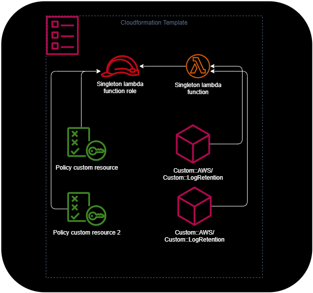

# cdk-nag-custom-nag-pack

[](#contributors)

## rules

| Rule ID | Cause                         | Explanation                                 |
| ------- | ----------------------------- | ------------------------------------------- |
| CR1     | Definend tags not exist       | Certain tags are checked if it exist        |
| CR2     | Definend tags has wrong value | Certain tags are checked with defined value |

## global suppressions

### custom resource

The `AwsCustomResource` (https://docs.aws.amazon.com/cdk/api/v2/docs/aws-cdk-lib.custom_resources.AwsCustomResource.html) creates a singleton lambda function and can't suppress at the resource level via `addResourceSuppressions` because it creates a lambda function resource on the stack.

In most cases the all the resources which ared created are managed by the CDK, so it's OK to suppress that "behind the scenes".



The same applies to `BucketDeployment` (https://docs.aws.amazon.com/cdk/api/v2/docs/aws-cdk-lib.aws_s3_deployment-readme.html). 

Handled custom resource types:
* `Custom::AWS`
* `Custom::LogRetention`
* `Custom::CDKBucketDeployment`
* `Custom::S3BucketNotifications`
* `Custom::SopsSync`

## config

```typescript
import { CustomChecks } from '@jaykingson/cdk-nag-custom-nag-pack'
...
Aspects.of(app).add(new CustomChecks({
  // use the whole set of this rules https://github.com/cdklabs/cdk-nag/blob/main/RULES.md#awssolutions
  enableAwsSolutionChecks: true,
  // use whatever tags you want to check
  cr1TagsToCheck: ['Environment', 'Owner'],
  cr2TagsWithValueToCheck: { Stage: ["dev", "prod"] },
  // activate the suppression of the custom resource singleton lambda
  suppressSingletonLambdaFindings: true,
}));
```

## Contributors

<!-- ALL-CONTRIBUTORS-LIST:START - Do not remove or modify this section -->
<!-- prettier-ignore-start -->
<!-- markdownlint-disable -->
<table>
  <tbody>
    <tr>
      <td align="center" valign="top" width="14.28%"><a href="http://deltikron.schafferhome.de"><br /><sub><b>Carl Schaffer</b></sub></a><br /><a href="#ideas-DeltiKron" title="Ideas, Planning, & Feedback">🤔</a></td>
    </tr>
  </tbody>
</table>

<!-- markdownlint-restore -->
<!-- prettier-ignore-end -->

<!-- ALL-CONTRIBUTORS-LIST:END -->
