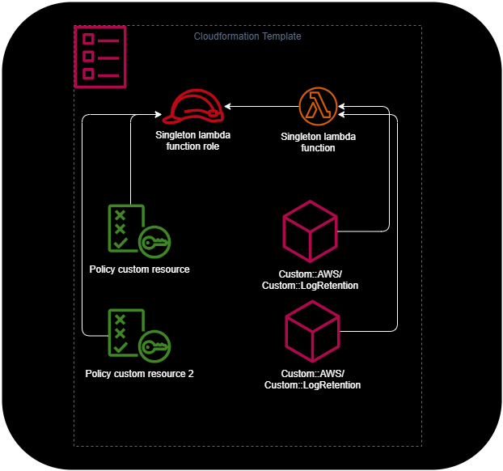

# cdk-nag-custom-nag-pack

[](#contributors)


## rules

| Rule ID | Cause                         | Explanation                                  |
| ------- | ----------------------------- | -------------------------------------------- |
| CR1     | Defined tags do not exist     | Certain tags are checked for existence       |
| CR2     | Defined tags have wrong value | Certain tags are checked with defined values |

## global suppressions

### custom resource

The `AwsCustomResource` (https://docs.aws.amazon.com/cdk/api/v2/docs/aws-cdk-lib.custom_resources.AwsCustomResource.html) creates a singleton lambda function and can't suppress at the resource level via `addResourceSuppressions` because it creates a lambda function resource on the stack.

In most cases, all the resources which are created are managed by the CDK, so it's OK to suppress that "behind the scenes".



The same applies to `BucketDeployment` (https://docs.aws.amazon.com/cdk/api/v2/docs/aws-cdk-lib.aws_s3_deployment-readme.html). 

Handled custom resource types:
* `Custom::AWS`
* `Custom::LogRetention`
* `Custom::CDKBucketDeployment`
* `Custom::S3BucketNotifications`
* `Custom::SopsSync`

### custom checks suppressions

This package exposes `CustomChecksSuppressions` as a central place for cdk-nag suppression helpers.

#### cdk-nag suppression for log buckets (AwsSolutions-S1)

There are two ways a bucket can be treated as a **log bucket**:

1) **Derived in-app**: when `enableLogBucketTagger: true` is enabled, this package identifies buckets that are used as `serverAccessLogsBucket` destinations and automatically tags + suppresses `AwsSolutions-S1`.
2) **Manually marked**: if a bucket in this CDK app will be used *externally* as a log bucket (and this cannot be derived from `serverAccessLogsBucket` usage in the same app), you can mark it explicitly.

> Important: `LogBucketTagger` is the single source of truth for the log-bucket tag names/values.
> `CustomChecksSuppressions.addS1SuppressionAndTagAsLogBucket(...)` delegates tagging to `LogBucketTagger` so the defaults (and any custom tag configuration) stay consistent.

Reason used:
"This is intended to be a log bucket. Log bucket does not require access logging to prevent infinite loop"

#### granular AwsSolutions-IAM5 suppressions

The `AwsSolutions-IAM5` rule flags IAM policies that use wildcard permissions (`*`) in actions or resources. While wildcards should generally be avoided, some AWS services require them for proper functionality (e.g., X-Ray tracing).

This package provides `CustomChecksSuppressions.addIam5StatementResourceSuppressions()` for **granular suppression** of specific IAM policy statements. Instead of suppressing all IAM5 findings for a resource, you can suppress only the exact policy statements that genuinely require wildcards.

##### Example usage

```typescript
import { CustomChecksSuppressions } from '@jaykingson/cdk-nag-custom-nag-pack'

const policyStatementForSuppression: PolicyStatementProps = {
  actions: ['xray:PutTelemetryRecords', 'xray:PutTraceSegments'],
  resources: ['*'],
  effect: Effect.ALLOW,
};

CustomChecksSuppressions.addIam5StatementResourceSuppressions(
  lambda,
  {
    id: 'AwsSolutions-IAM5',
    reason: 'Wildcard required for X-Ray - see https://docs.aws.amazon.com/xray/latest/devguide/security_iam_service-with-iam.html',
    appliesTo: [policyStatementForSuppression],
  },
  true, // applyToChildren
);
```

##### helpers

```typescript
import { CustomChecksSuppressions } from '@jaykingson/cdk-nag-custom-nag-pack'

// Marks the bucket as a log bucket (tags + suppresses AwsSolutions-S1)
CustomChecksSuppressions.addS1SuppressionAndTagAsLogBucket(myLogBucket);
```

## log bucket tagger

Third-party security scanners often flag S3 buckets that don't have server access logging enabled. However, log buckets themselves cannot have their own log bucket (that would create infinite recursion). The `enableLogBucketTagger` option automatically tags S3 buckets used as logging destinations, making it easier for security scanners to identify and exclude them from "missing logging" checks.

### Tags applied

| Tag Name | Tag Value | Description |
| -------- | --------- | ----------- |
| `isLogBucket` | `true` | Identifies the bucket as a log destination |
| `LogBucketTaggedBy` | `cdkNagCustomChecks` | Identifies that this package applied the tag |

> Note: The defaults above are owned by `LogBucketTagger`.
> If you configure custom tag names/values on `LogBucketTagger`, those will be used consistently for both auto-tagging and manual marking.

### How it works

The tagger identifies log buckets by inspecting the `LoggingConfiguration.DestinationBucketName` property of S3 buckets. It supports:

- **Same-stack references** via `Ref` or `Fn::GetAtt`
- **Cross-stack references** via `Fn::ImportValue` (when applied at App level)

> **Note:** Buckets referenced by string literals (external bucket names) cannot be tagged as they exist outside the CDK app.

### Usage

```typescript
Aspects.of(app).add(new CustomChecks({
  enableLogBucketTagger: true,
}));
```

> Note: When `enableLogBucketTagger: true` is enabled, the log bucket `AwsSolutions-S1` suppression is applied automatically to identified log buckets.

If you create a bucket that will be used as a log bucket by systems outside of this CDK app, you can manually mark it using `CustomChecksSuppressions.addS1SuppressionAndTagAsLogBucket(...)`.

## config

```typescript
import { CustomChecks } from '@jaykingson/cdk-nag-custom-nag-pack'
...
Aspects.of(app).add(new CustomChecks({
  // use the whole set of this rules https://github.com/cdklabs/cdk-nag/blob/main/RULES.md#awssolutions
  enableAwsSolutionChecks: true,
  // use whatever tags you want to check
  cr1TagsToCheck: ['Environment', 'Owner'],
  cr2TagsWithValueToCheck: { Stage: ["dev", "prod"] },
  // activate the suppression of the custom resource singleton lambda
  suppressSingletonLambdaFindings: true,
  // automatically tag S3 log buckets for security scanners
  enableLogBucketTagger: true,
}));
```

## Contributors

<!-- ALL-CONTRIBUTORS-LIST:START - Do not remove or modify this section -->
<!-- prettier-ignore-start -->
<!-- markdownlint-disable -->
<table>
  <tbody>
    <tr>
      <td align="center" valign="top" width="14.28%"><a href="http://deltikron.schafferhome.de"><br /><sub><b>Carl Schaffer</b></sub></a><br /><a href="#ideas-DeltiKron" title="Ideas, Planning, & Feedback">🤔</a></td>
    </tr>
  </tbody>
</table>

<!-- markdownlint-restore -->
<!-- prettier-ignore-end -->

<!-- ALL-CONTRIBUTORS-LIST:END -->
